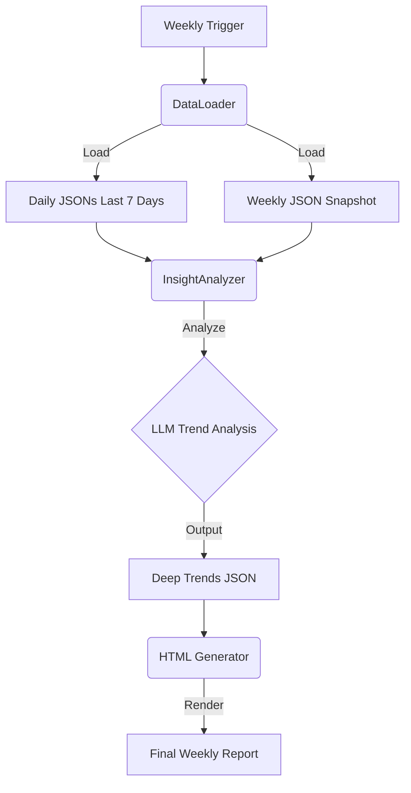

# GitHub AI Trending 周报功能 - 深度趋势分析 Spec

## 1. 核心目标
在现有周报基础上，增加一个**全自动**、**基于跨天数据聚合**的"深度趋势" (Deep Trends) 版块。该版块旨在通过 AI 分析过去 7 天的所有项目，识别出隐藏的宏观技术趋势（如从"大模型硬件要求高"推导出的"边缘计算/去中心化"趋势），并以**深度叙事**的方式呈现。

## 2. 数据流架构 (Data Flow)



### 2.1 数据源
- **输入**：
  - `data/briefs/daily/data-YYYY-MM-DD.json` (过去 7 天)
  - `data/briefs/weekly/data-weekly-YYYY-Wxx.json` (本周快照)
- **聚合逻辑**：
  - 不仅仅是简单的数量叠加。
  - 提取所有项目的 `description`, `analysis.trends`, `analysis.coreFunctions`。
  - 按时间轴组织数据（Day 1 -> Day 7），以便 AI 识别演变过程。

## 3. 深度趋势分析器 (Trend Analyzer)

### 3.1 Prompt 设计核心
提示词需要明确要求 LLM 进行"二阶推理" (Second-order reasoning)：
- **禁止**：只罗列热门项目（这是 Top Projects 版块做的事）。
- **要求**：
  - 寻找"因果关系"或"共同痛点"（例如：多个项目都在解决显存不足的问题）。
  - 识别"跨领域联系"（例如：一个 Web 框架和一个 AI 模型都在强调 'Local-first'）。
  - 输出格式必须包含：
    - `title`: 极具洞察力的标题（如 "AI 算力的去中心化革命"）。
    - `summary`: 核心论点摘要。
    - `content`: 详细的叙事文本（支持 Markdown，分段落）。
    - `evidence`: 支撑论点的具体项目列表（引用 Day X 的 Project Y）。

### 3.2 输出 JSON 结构
```json
{
  "deep_trends": [
    {
      "title": "边缘计算的崛起：AI 正在逃离云端",
      "summary": "本周多个高星项目显示，开发者正致力于将大模型能力下放到消费级硬件。",
      "content": "随着满血大模型对显存需求的指数级增长（如 Grok-1 需要 300GB+），本周社区出现了一股强烈的'反向'趋势...",
      "evidence": [
        { "name": "BitNet", "day": "Monday", "reason": "1-bit 量化技术将推理成本降低 10 倍" },
        { "name": "Lightpanda", "day": "Tuesday", "reason": "无头浏览器支持本地自动化，减少云端依赖" }
      ]
    }
  ]
}
```

## 4. UI/UX 设计 (Narrative Style)

### 4.1 布局结构
- **位置**：置于"周度概览" (Stats) 之后，"热门项目" (Top Projects) 之前。
- **样式**：
  - **宽屏卡片**：占据整行宽度，强调阅读体验。
  - **左文右图/表**（可选）：左侧是深度文章，右侧是关联项目的微型列表。
  - **引用块 (Blockquote)**：高亮核心洞察金句。
  - **时间线标记**：在提及项目时，标记其出现的时间点（Mon/Tue/Wed），体现时间维度的连续性。

### 4.2 视觉元素
- 字体：使用衬线体或阅读感更好的无衬线体（区别于代码列表的机械感）。
- 强调色：使用绿色 (`#00ff41`) 高亮关键趋势词。
